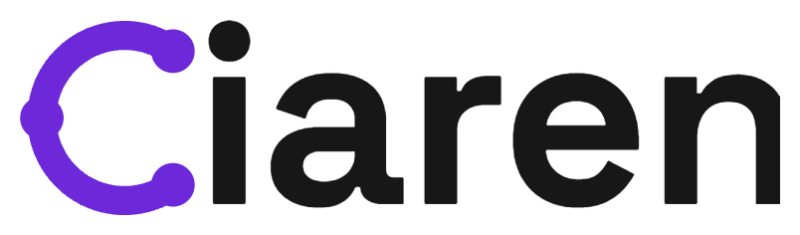
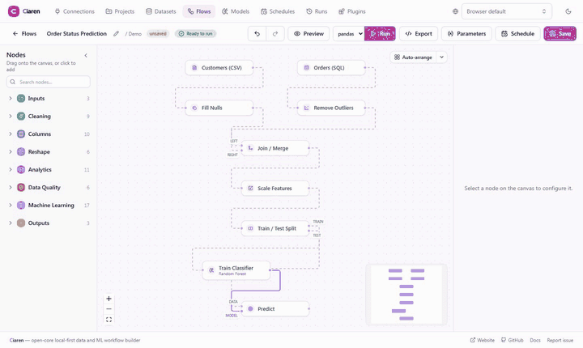
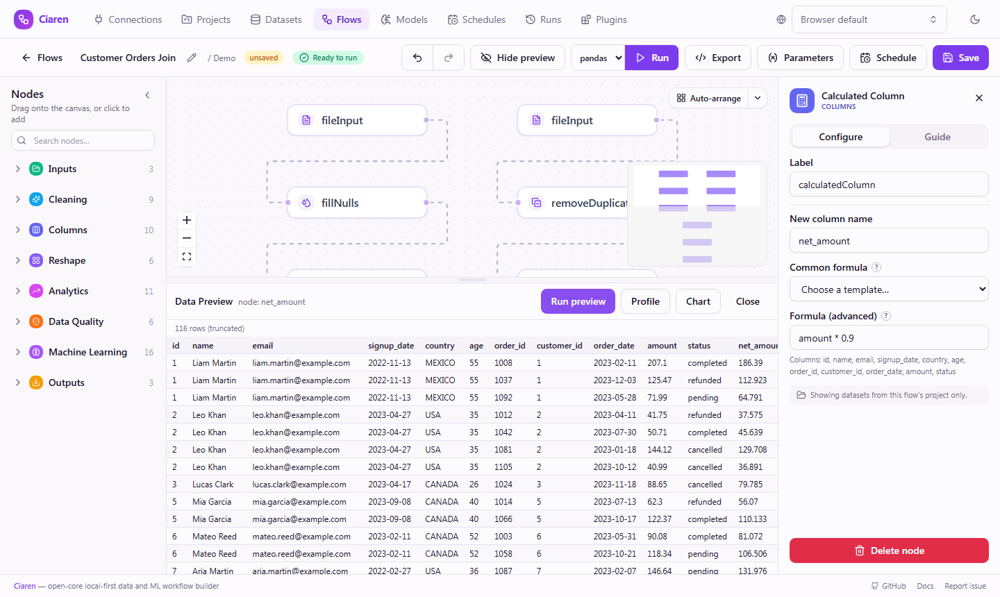

<p align="center">
  
</p>

<p align="center">
  <strong>Local-first visual data and ML workflows that export clean Python.</strong>
</p>

<p align="center">
  Build on a canvas. Preview every step. Run locally. Export readable pandas,
  Polars, or lazy Polars code with no proprietary runtime.
</p>

<p align="center">
  <a href="https://ciaren.com/docs/">Docs</a>
  · <a href="https://ciaren.com/docs/guide/quick-start">Quick Start</a>
  · <a href="https://ciaren.com/docs/plugins/overview">Plugins</a>
  · <a href="https://github.com/ciaren-labs/Ciaren/discussions">Discussions</a>
  · <a href="CONTRIBUTING.md">Contributing</a>
</p>

<p align="center">
  <a href="https://pypi.org/project/ciaren/"></a>
  <a href="https://github.com/ciaren-labs/Ciaren/actions/workflows/backend-tests.yml"></a>
  <a href="https://github.com/ciaren-labs/Ciaren/actions/workflows/frontend-tests.yml"></a>
  <a href="https://github.com/ciaren-labs/Ciaren/actions/workflows/docker.yml"></a>
  <a href="LICENSE"></a>
  <a href="backend/app/plugin_api/"></a>
  
  
</p>



## What Is Ciaren?

Ciaren is an open-core, plugin-first platform for building data engineering and
lightweight machine-learning workflows visually, then exporting them as ordinary
Python.

It is built for people who want the speed of a visual tool without giving up the
clarity, portability, and reviewability of code.

```bash
python -m pip install --pre ciaren
ciaren serve
```

Open `http://localhost:8055`. The PyPI wheel bundles the React editor, so users
do **not** install a separate frontend package. One install starts the API,
scheduler, and web UI.

> **Alpha software.** Ciaren is under active development. APIs, workflow
> formats, generated code, plugin interfaces, and internal data models may
> change before `1.0.0`. Use it for learning, prototypes, and controlled
> internal workflows before relying on it for critical production jobs.

## Why It Feels Different

| You get | Why it matters |
| --- | --- |
| **Visual workflow building** | Design pipelines faster than writing every dataframe step by hand. |
| **Live node previews** | Inspect data samples and schema changes before running the full flow. |
| **Clean Python export** | Generate standalone pandas, Polars, or lazy Polars scripts you can review and run outside Ciaren. |
| **Local-first execution** | SQLite works out of the box, and your data does not need to leave your machine. |
| **Data engineering + ML** | Ingest, clean, validate, engineer features, train, evaluate, predict, and export from one canvas. |
| **Plugin-first architecture** | Add custom nodes, connectors, engines, model providers, validators, and exporters outside core. |

Ciaren is not a hosted no-code black box. Every node maps to understandable
dataframe behavior, every run leaves inspectable results, and every flow can
become code.

## Quickstart

### Install From PyPI

During alpha, use `--pre` so pip can install pre-release versions:

```bash
python -m pip install --upgrade pip
python -m pip install --pre ciaren
ciaren serve
```

Open `http://localhost:8055`, then open **Projects -> Demo**. The first start
seeds sample datasets and working example flows, so you can preview, run, and
export something real before uploading your own data.

For repeatable evaluation, pin the first alpha release:

```bash
python -m pip install "ciaren==0.1.0a1"
```

PyPI normalizes `0.1.0-alpha.1` to the PEP 440 version `0.1.0a1`.

### Run With Docker

```bash
git clone https://github.com/ciaren-labs/Ciaren.git
cd Ciaren
docker compose up --build
```

Open `http://localhost:8055`.

### Run From Source

Use this path when contributing to the backend, frontend, docs, or plugin SDK.

Requirements: Python 3.12+, Node.js 18+, and Git.

```bash
git clone https://github.com/ciaren-labs/Ciaren.git
cd Ciaren/backend

python -m venv .venv
source .venv/bin/activate        # Windows: .venv\Scripts\activate

pip install -e .
ciaren serve
```

In a second terminal:

```bash
cd Ciaren/frontend
npm install
npm run dev
```

Open `http://localhost:5173` for the live development frontend. The backend API
and Swagger docs stay on `http://localhost:8055`.

## What You Can Build



- **Input and output:** CSV, TSV, Excel, Parquet, JSON/JSONL, text, SQL
  databases, S3, GCS, and Azure Blob.
- **Cleaning:** drop/fill nulls, remove duplicates, rename/select/drop columns,
  cast types, replace values.
- **Transformation:** filters, joins, group by, aggregate, calculated columns,
  maps, pivots, windows, sorting, sampling.
- **Data quality:** assert not-null, unique, value ranges, row count,
  expressions, and allowed values.
- **Machine learning:** split, train, cross-validate, predict, evaluate,
  feature engineering, importance, and MLflow tracking.
- **Operations:** run history, scheduling, REST API, CLI, webhook trigger, and
  Python SDK.

## Exported Code Is the Escape Hatch

A simple read -> clean -> aggregate -> write flow can export to code like this:

```python
import polars as pl

df_1 = pl.read_csv("sales.csv")
df_1 = df_1.drop_nulls(subset=["amount"])
df_1 = df_1.group_by(["region"]).agg([pl.col("amount").sum().alias("amount")])
df_1.write_csv("summary.csv")
```

The same flow can also export pandas or lazy Polars variants where supported.
That makes Ciaren useful for prototyping, teaching, code review, and migration
from visual exploration into normal Python projects.

## Built for Extension

Ciaren's open core stays focused on the shared workflow platform. Specialized
integrations should usually be plugins, not one-off patches to core.

| Extension point | Examples |
| --- | --- |
| **Nodes** | Custom transforms, validators, AI-assisted steps, domain-specific operations |
| **Connectors and storage** | Internal APIs, SaaS tools, warehouses, object stores, document databases |
| **Model providers** | Local models, scikit-learn estimators, organization-specific training logic |
| **Execution engines** | Alternative dataframe engines and future runtime targets |
| **Exporters** | Code targets, deployment bundles, validation reports |

Plugins can be packaged as `.ciarenplugin` files, signed, inspected, installed,
enabled, disabled, and distributed independently.

Start here:

- [Plugins Overview](https://ciaren.com/docs/plugins/overview)
- [Build Your First Plugin](https://ciaren.com/docs/plugins/first-plugin)
- [Plugin API Reference](https://ciaren.com/docs/plugins/api-reference)

## Who It Is For

- **Data analysts:** clean, reshape, validate, and export datasets without
  writing every step by hand.
- **Data engineers:** prototype repeatable local pipelines, inspect generated
  code, then automate with CLI/API/SDK workflows.
- **Python learners:** see how visual dataframe operations become pandas and
  Polars code.
- **ML practitioners:** try lightweight ML flows with local MLflow tracking.
- **Plugin authors:** ship custom nodes, connectors, engines, and model
  providers without maintaining a fork.
- **Open-source contributors:** help polish the editor, execution engine,
  transformations, docs, tests, and plugin SDK.

## Documentation

- [Installation](https://ciaren.com/docs/guide/installation) - PyPI, Docker,
  source installs, extras, and troubleshooting.
- [Quick Start](https://ciaren.com/docs/guide/quick-start) - build your first
  flow in five minutes.
- [Demo Project & Tutorials](https://ciaren.com/docs/guide/demo-project) - walk
  through the seeded example flows.
- [Examples](https://ciaren.com/docs/examples/sales-analysis) - end-to-end
  workflow walkthroughs.
- [Machine Learning Quick Start](https://ciaren.com/docs/guide/ml-quickstart) -
  train and evaluate a model on the canvas.
- [Plugin Guide](https://ciaren.com/docs/plugins/first-plugin) - build your
  first plugin.
- [Roadmap](https://ciaren.com/docs/guide/roadmap)
- [Security](SECURITY.md)
- [Contributing](CONTRIBUTING.md)

## Optional Extras

The base install includes the core app, pandas, Polars, scikit-learn models,
MLflow tracking, and the bundled web UI.

Install extras only when you need specific drivers or optional model families:

```bash
python -m pip install --pre "ciaren[postgres]"
python -m pip install --pre "ciaren[s3]"
python -m pip install --pre "ciaren[ml]"        # XGBoost and LightGBM choices
python -m pip install --pre "ciaren[signing]"   # plugin signing support
```

The separate `ciaren-client` package is only for scripts that need to call a
running Ciaren server. It is not required to use the visual app.

## Contributing

Ciaren is early, and useful contributions are welcome: reproducible bugs,
example flows, docs improvements, transformation nodes, plugin SDK improvements,
frontend workflow polish, tests, and focused core fixes.

The open core is intentionally lightweight. New niche databases, SaaS products,
internal APIs, proprietary storage systems, and organization-specific model
logic should normally be built as plugins. If the SDK blocks that work, open an
SDK-focused issue or discussion.

Start with [CONTRIBUTING.md](CONTRIBUTING.md). Questions and ideas can go to
[GitHub Discussions](https://github.com/ciaren-labs/Ciaren/discussions), and
reproducible bugs or focused feature requests can go to
[GitHub Issues](https://github.com/ciaren-labs/Ciaren/issues).

If Ciaren is the kind of local-first Python data tool you want to see grow, a
GitHub star helps the launch and makes the project easier for others to find.

## Security

Ciaren is alpha software intended for local-first experimentation, prototyping,
and controlled self-hosted workflows. Review exported Python code, test flows
before using important data, and add appropriate operational controls before
using Ciaren in sensitive or critical environments.

Please report vulnerabilities using the process in [SECURITY.md](SECURITY.md).

## Licensing

- **Ciaren Core:** AGPL-3.0-only.
- **Public Plugin API / SDK:** Apache-2.0.
- **Plugins:** may use their own compatible license, depending on the plugin
  author and distribution model.
- **Future cloud or hosted services:** not necessarily covered by this open
  source repository license.

See [LICENSE](LICENSE), [NOTICE](NOTICE), and [LICENSES/](LICENSES/) for the
complete license texts and notices.

## Project Status

- Current stage: **Alpha**
- First public release: `0.1.0-alpha.1` — this is also the **git tag** to push.
  Push it **without** a `v` prefix (`git tag 0.1.0-alpha.1`); the tag is what
  triggers the PyPI publish workflow, and it only matches unprefixed versions.
- PyPI version for the first alpha: `0.1.0a1` (PyPI normalizes the tag to PEP 440).
- Breaking changes are expected before `1.0.0`

Made for data practitioners who value local workflows, transparent execution,
and Python they can actually read.
