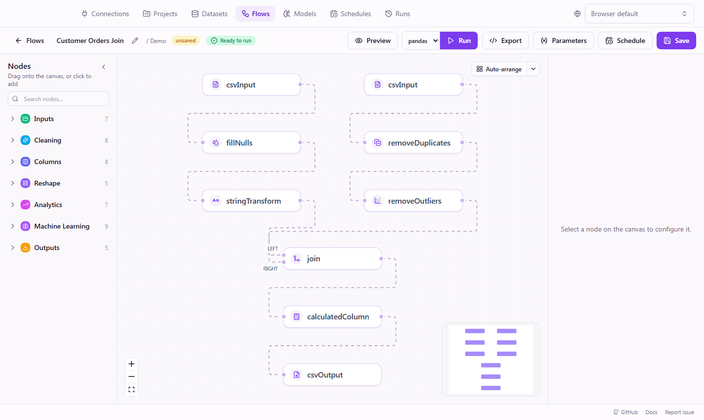

# FlowFrame

**Build data pipelines visually. Run them locally. Export clean pandas or polars code.**

FlowFrame is an open-core, local-first platform for building data and ML
workflows visually, without Airflow-level infrastructure or opaque desktop
automation. Upload a file, connect SQL, clean and reshape data, train models on
a canvas, preview every step, schedule runs, and take the generated Python with
you.

[](https://github.com/rodrigo-arenas/FlowFrame/actions/workflows/backend-tests.yml)
[](https://github.com/rodrigo-arenas/FlowFrame/actions/workflows/frontend-tests.yml)
[](https://github.com/rodrigo-arenas/FlowFrame/actions/workflows/docker.yml)
[](https://github.com/rodrigo-arenas/FlowFrame/actions/workflows/docs-deploy.yml)
[](LICENSE)
[](backend/app/plugin_api/)




## Why People Try It

- **See every step**: preview intermediate data instead of guessing what a script did.
- **Keep ownership**: run locally with SQLite by default; no SaaS lock-in.
- **Export real code**: pandas, polars, and optimized lazy polars output.
- **Automate without ceremony**: schedule recurring flows from the same local app.
- **Extend it**: build plugins against the Apache-2.0 public Plugin API/SDK.
- **Teach and collaborate**: visual flows make data logic easier to review than one-off notebooks.

## Try It In 5 Minutes

```bash
git clone https://github.com/rodrigo-arenas/FlowFrame.git
cd FlowFrame/backend
python -m venv .venv
source .venv/bin/activate        # Windows: .venv\Scripts\activate
pip install -e .
flowframe serve
```

In another terminal:

```bash
cd FlowFrame/frontend
npm install
npm run dev
```

Open `http://localhost:5173`, upload a CSV/Excel/Parquet file, build a flow,
preview the data, run it, and export Python.

Prefer Docker?

```bash
docker compose up --build
```

Then open `http://localhost:8055`. The image uses the same `flowframe` CLI as
the pip install path: it applies migrations with `flowframe db upgrade` and
starts the app with `flowframe serve`.

## Who It Is For

| If you are... | FlowFrame helps you... |
|---------------|------------------------|
| Data analyst | Clean, reshape, validate, and export datasets without writing every step by hand |
| Data engineer | Prototype repeatable transformations locally before turning them into code |
| Python learner | See how visual dataframe operations become readable pandas/polars code |
| ML practitioner | Build simple preprocessing/training flows with optional MLflow tracking |
| Plugin author | Ship custom nodes and integrations through a stable public SDK/API |

---

> ⚠️ **Alpha software.** FlowFrame is in early development. APIs, the data model,
> and generated code may change without notice between releases, and there is no
> long-term stability guarantee yet. Use it for experimentation, prototypes, and
> controlled internal workflows before relying on it for critical production jobs.

---

## What is FlowFrame?

FlowFrame is an open-core, **local-first** visual workflow builder for data
engineering and machine learning on **small and medium datasets**. It lets you:

- **Connect** CSV, Excel, or Parquet files — or read straight from a SQL database
- **Build** transformation pipelines on a drag-and-drop canvas
- **Preview** intermediate results before running the full flow
- **Execute** flows with a single click — on **polars** (default) or **pandas**
- **Export** the equivalent, readable Python — pandas, polars, or optimized lazy polars
- **Schedule** flows to run automatically with a built-in cron scheduler
- **Train** machine-learning models visually and track them with MLflow — an
  optional extension (`pip install "flowframe[ml]"`)

Each visual node maps to **one clear dataframe operation** — so the generated
code is readable whenever you export it, and execution is transparent. FlowFrame
is intentionally lightweight — it is **not** an Airflow/dbt/Spark replacement,
and does not do distributed or streaming execution.

Built for **data analysts, data engineers, and developers** who want repeatable
data and ML workflows without the infrastructure overhead — and accessible enough for
business analysts and Python beginners who are just getting started.

### Build visually, run instantly, export when you need to

A three-step flow (read → drop nulls → group & sum) runs with one click and
produces clean Python you can take anywhere:

```python
import polars as pl

df_1 = pl.read_csv("sales.csv")
df_2 = df_1.drop_nulls(subset=["amount"])
df_3 = df_2.group_by(["region"]).agg([pl.col("amount").sum().alias("amount")])
df_3.write_csv("summary.csv")
```

No black box, no proprietary runtime — copy the script and run it anywhere Python
runs. Need it to scale? Export the **lazy polars** variant (`scan_*` → `collect()`)
for pushdown and join optimization on large files.

---

## ✨ Key Features

| Feature | Details |
|---------|---------|
| **Visual Builder** | Drag-and-drop nodes for cleaning, reshaping, joining, and aggregating data |
| **42 Transformation Nodes** | From drop-nulls to data-quality assertions, window functions, joins, pivots, and conditional columns |
| **Live Preview** | See data changes at each step before running the full pipeline |
| **Code Export** | Download readable, standalone Python — pandas, polars, or optimized **lazy** polars |
| **polars or pandas** | Runs on polars by default; switch engines per run |
| **SQL Databases** | Read from and write to SQL databases via saved connections, alongside files |
| **Local-First** | Runs entirely on your machine — no SaaS, no cloud lock-in |
| **Versioned Datasets** | Re-uploading a file keeps every version, so flows stay reproducible |
| **Scheduling** | Built-in cron scheduler with retries, catch-up, and auto-disable |
| **Projects & Runs** | Group work into projects; browse run history and per-node results |
| **Machine Learning** *(optional)* | Split, train, predict, and evaluate models on the canvas; tracked with MLflow |
| **Extensible** | Add custom transformation nodes on the backend |

---

## ⚡ Quick Start

### Requirements

- **Python 3.12+**
- **Node.js 18+** (only for the visual editor / frontend)
- **SQLite** is the zero-setup default. PostgreSQL / MySQL are optional, via
  `FLOWFRAME_DATABASE_URL` (async driver required).

### 1. Clone and start the backend

```bash
git clone https://github.com/rodrigo-arenas/FlowFrame.git
cd FlowFrame/backend

# Create and activate a virtual environment
python -m venv .venv
source .venv/bin/activate        # Windows: .venv\Scripts\activate

# Install FlowFrame (add the optional ML extension with: pip install -e ".[ml]")
pip install -e .

# Run the API + background scheduler in one process
flowframe serve
```

The backend starts on `http://localhost:8055` and **creates its database
automatically** on first start — there is no migration step to run. Open the
interactive API docs at `http://localhost:8055/docs`.

> `flowframe serve` is the recommended entry point. It also accepts flags such as
> `--port`, `--db-url`, `--engine`, and `--no-scheduler`. See `flowframe --help`,
> or use `flowframe init` / `info` / `check` to scaffold and validate config.

### 2. Start the frontend (visual editor)

```bash
cd ../frontend

npm install
npm run dev
```

The editor runs on `http://localhost:5173` and proxies API calls to the backend
on port `8055`.

### 3. Try it out

1. Open `http://localhost:5173`
2. Upload a CSV, Excel, or Parquet file
3. Build a flow (e.g. drop nulls → rename columns → filter rows → group & aggregate)
4. Preview results as you go
5. Run the flow, then export the generated Python code

Prefer the API? Everything above is also available over REST — see the
[Quick Start guide](https://rodrigo-arenas.github.io/FlowFrame/guide/quick-start).

---

## 📚 Documentation

Full docs (guides, transformation reference, examples, API) are published at
**<https://rodrigo-arenas.github.io/FlowFrame>**.

- **[Quick Start](https://rodrigo-arenas.github.io/FlowFrame/guide/quick-start)** — Install, run, and build your first flow
- **[Examples](https://rodrigo-arenas.github.io/FlowFrame/examples/sales-analysis)** — Sales analysis, data quality, feature engineering, ML, and more
- **[Plugin Guide](https://rodrigo-arenas.github.io/FlowFrame/plugins/first-plugin)** — Build your first custom plugin
- **[CONTRIBUTING.md](CONTRIBUTING.md)** — Development workflow, standards, and review process
- **[CHANGELOG.md](CHANGELOG.md)** — Release notes and public alpha readiness changes
- **[architecture.md](architecture.md)** — System design, entity models, and execution flow
- **[SUPPORT.md](SUPPORT.md)** — Where to ask questions, report bugs, and request features
- **[MAINTAINERS.md](MAINTAINERS.md)** — Maintainer responsibilities and review policy

---

## 🛠️ Transformation Nodes

FlowFrame ships with file & SQL input/output plus **42 transformation nodes**. The
authoritative list lives in [`backend/app/engine/registry.py`](backend/app/engine/registry.py).

### Input / Output

- CSV, Excel, Parquet (read and write)
- SQL databases (read and write) via saved connections

### Cleaning & columns

- Drop / rename / select columns
- Change data types (cast)
- Drop nulls / fill nulls
- Remove duplicates
- Replace values, string operations, split a column, map values
- Round numbers, remove outliers

### Rows

- Filter rows, sort, limit, sample

### Reshape & combine

- Calculated column, conditional column, group by + aggregate
- Join / merge, union / concat
- Pivot, unpivot, window functions
- Parse dates, extract date parts, bin a column

---

## 🤖 Machine Learning (optional extension)

FlowFrame includes an optional, **high-guardrail** ML extension so you can go
from raw data to a tracked model without leaving the canvas. It is off by default
and ships as an extra:

```bash
pip install "flowframe[ml]"      # adds scikit-learn, XGBoost, LightGBM, MLflow
```

Once installed and enabled (`FLOWFRAME_ML_ENABLED=true`, the default), a
**Machine Learning** category appears in the node palette:

- **Train / Test Split** — one node, two clearly-labelled `train` / `test` outputs
- **Feature engineering** — Scale Features, Encode Categories, Select Features,
  Reduce Dimensions (PCA). *(Fill missing values with the standard Fill Nulls node.)*
- **Train Model** — pick a classifier, regressor, or clustering model; tune the
  common hyperparameters inline or open **Advanced options** for the full set,
  cross-validation, and in-pipeline preprocessing. The chosen model shows on the
  canvas node.
- **Predict** — score new data using a wired model or a registered MLflow model URI
- **Evaluate** & **Feature Importance** — metrics, confusion matrix, and rankings

Every trained model is logged to **MLflow**. A built-in **Local MLflow**
connection (in the Connections page) points at `./mlruns` by default and is the
single source of truth for the tracking URI — edit and test it to use any
tracking server, no restart needed. A dedicated **Models** page shows your
registered models (versions, aliases, metrics, and lineage back to the flow/run
that produced them) and an experiment leaderboard. Model loading is sandboxed to
a validated artifact directory.

The demo project ships ML example flows too (classification, train/validate,
regression, PCA); `flowframe serve --run-seed-flows` runs every demo flow once
on first boot so the Runs and Models views aren't empty. See the
[ML Quick Start](https://rodrigo-arenas.github.io/FlowFrame/guide/ml-quickstart).

---

## 🏗️ Tech Stack

**Backend:** Python 3.12+, FastAPI, Pydantic v2, SQLAlchemy 2.x (async), pandas,
polars. Default dataframe engine is **polars**; pandas is fully supported and
selectable per run.

**Frontend:** React 19, TypeScript (strict), Vite, @xyflow/react, TanStack Query,
Zustand, shadcn/ui, Tailwind CSS.

**Database:** SQLite by default (file or in-memory). PostgreSQL / MySQL supported
via `DATABASE_URL` — **always use an async driver** (`sqlite+aiosqlite://`,
`postgresql+asyncpg://`, `mysql+aiomysql://`).

---

## Security and Maturity

FlowFrame is alpha software. It is designed for local-first experimentation,
analysis, prototyping, and self-hosted workflows where the operator controls the
environment.

Parts of the project have been developed with AI assistance and human review.
FlowFrame has not yet completed a formal independent third-party security audit.
Security-sensitive areas are tested and reviewed, but teams using FlowFrame with
sensitive data or production workflows should perform their own review and add
appropriate operational controls.

Recommended practices:

- Test flows thoroughly before running on important data
- Review exported Python code before deploying it elsewhere
- Keep FlowFrame local or behind trusted access controls
- Report bugs and security issues responsibly (see [SECURITY.md](SECURITY.md))
- Add independent validation before using FlowFrame for critical or regulated workflows

---

## 🤝 Contributing

We want FlowFrame to be easy to try, easy to extend, and genuinely welcoming to
new contributors. Useful contributions include:

- New transformation nodes and examples
- Plugin SDK/API improvements
- Frontend workflow polish
- Docker and install experience improvements
- Documentation, tutorials, screenshots, and recipes
- Bug reports with reproducible flows or sample data

**First time?** See [CONTRIBUTING.md](CONTRIBUTING.md) for environment setup, code
style, testing expectations, and the PR process. Look for issues labeled
[`good first issue`](https://github.com/rodrigo-arenas/FlowFrame/labels/good%20first%20issue)
or [`help wanted`](https://github.com/rodrigo-arenas/FlowFrame/labels/help%20wanted).
Every new transformation must include tests.

**Ideas?** Open a [GitHub Discussion](https://github.com/rodrigo-arenas/FlowFrame/discussions)
or [Issue](https://github.com/rodrigo-arenas/FlowFrame/issues).

Want to build an ecosystem around FlowFrame? Start with the
[plugin docs](https://rodrigo-arenas.github.io/FlowFrame/plugins/overview) and
the Apache-2.0 public SDK in `backend/app/plugin_api/`.

---

## Licensing

FlowFrame uses a dual licensing model:

- **FlowFrame Core** is licensed under **AGPL-3.0-only**. This includes the
  application, backend, frontend, execution engine, connectors, scheduler,
  bundled services, and repository content unless a more specific license notice
  says otherwise.
- The public **Plugin API/SDK** located at `backend/app/plugin_api/` is licensed
  separately under **Apache-2.0** so plugin developers can build against a stable
  public contract without adopting the core license for their own plugins.
- Plugins created using the public Plugin API may use the license selected by
  their authors, including MIT, Apache-2.0, GPL, AGPL, commercial, or
  proprietary licenses.
- Official Premium Plugins may be distributed under commercial licenses.
- Marketplace plugins use the license chosen by their authors.
- Cloud services such as the Marketplace backend, AI Credits backend, licensing
  server, billing, hosted sync, and related hosted infrastructure are outside
  the scope of this open-source repository license and may remain proprietary.

See [LICENSE](LICENSE), [NOTICE](NOTICE), and [LICENSES/](LICENSES/) for the
complete license texts and notices.

## Brand and Trademarks

The FlowFrame name and logo identify the official project. Community plugins,
forks, tutorials, and integrations are welcome, but they must not imply official
status or endorsement unless that is true.

See [TRADEMARKS.md](TRADEMARKS.md) and
[BRAND_GUIDELINES.md](BRAND_GUIDELINES.md) for naming, logo, plugin, and
marketplace guidance.

---

## 🙏 Acknowledgments

- Created and maintained by **Rodrigo Arenas** — [rodrigo-arenas.com](https://www.rodrigo-arenas.com/) · [GitHub](https://github.com/rodrigo-arenas)
- Built with [FastAPI](https://fastapi.tiangolo.com/), [React Flow](https://reactflow.dev/),
  [pandas](https://pandas.pydata.org/), [polars](https://pola.rs/), and [shadcn/ui](https://ui.shadcn.com/)
- Inspired by the simplicity of pandas and the visual design of node-based editors

---

## 📞 Support

- **Questions?** [GitHub Discussions](https://github.com/rodrigo-arenas/FlowFrame/discussions)
- **Found a bug?** [Open an Issue](https://github.com/rodrigo-arenas/FlowFrame/issues)
- **Security concern?** See [SECURITY.md](SECURITY.md)

---

**Made with ❤️ for data practitioners who value simplicity and reproducibility.**
