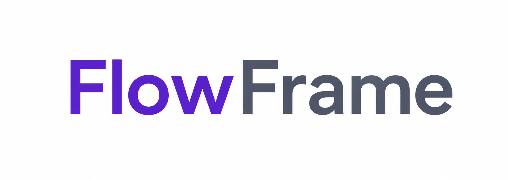

<div align="center">



### The plugin-first, local-first platform for building Data Engineering & Machine Learning workflows — visually, with Python you can read.

Build data and ML pipelines on a drag-and-drop canvas, preview every step, run
them locally, schedule them — and export the equivalent **pandas** or **polars**
code whenever you want. Every capability, from nodes to connectors to execution
engines, is a **plugin**.

[](LICENSE)
[](backend/pyproject.toml)


[](https://rodrigo-arenas.github.io/FlowFrame)

[**Documentation**](https://rodrigo-arenas.github.io/FlowFrame) ·
[**Quick Start**](#-quick-start) ·
[**Plugin Platform**](#-a-plugin-first-platform) ·
[**Workflow Lifecycle**](#-one-canvas-the-whole-workflow) ·
[**Contributing**](#-contributing)

</div>

---

> ⚠️ **Alpha software.** FlowFrame is in early development. APIs, the data model,
> and generated code may change without notice between releases, and there is no
> stability guarantee yet. Use it for experimentation — not production pipelines.

---

## What is FlowFrame?

FlowFrame is an open-source platform for building **Data Engineering and Machine
Learning workflows visually** — and turning them into readable, portable Python.
It's more than a visual ETL tool: it's a **plugin-first, local-first development
environment** where the whole workflow lifecycle lives on one canvas, and almost
every capability is an extension point.

It rests on a few principles:

- **🐍 Visual-first, but Python-native.** Every node maps to one clear dataframe
  operation. Export the exact **pandas** or **polars** code at any time — no black
  box, no proprietary runtime, no lock-in.
- **🔒 Local-first.** It runs entirely on your machine. You own your data and your
  execution — no SaaS account, no cloud upload required.
- **🧩 Plugin-first.** Nodes, connectors, storage, execution engines, exporters,
  validators, and AI capabilities are all defined as stable provider contracts.
  Virtually every part of FlowFrame can be extended — and packaged, signed, and
  shared.
- **⚙️ Multi-engine.** Runs on **polars** (default) or **pandas** today, selectable
  per run — behind a pluggable engine contract designed to grow.
- **🔁 Full lifecycle.** Ingestion → transformation → validation → feature
  engineering → model training → evaluation → inference, all on one canvas.

Built for **data engineers, data analysts, and developers** who want repeatable
pipelines without infrastructure overhead — and approachable enough for business
analysts and Python beginners getting started.

<div align="center">
  
  <br />
  <em>One canvas: ingest, clean, reshape, validate, train, and export — node by node.</em>
</div>

---

## 🤔 Why FlowFrame?

Most data and ML work lives in throwaway notebooks and one-off scripts that are
hard to re-run, share, or trust. Heavyweight orchestrators (Airflow, dbt, Spark)
solve a *different* problem and bring infrastructure you don't want for a 50 MB
CSV or a quick model.

FlowFrame sits in the gap — and goes further than a visual ETL builder:

- **Not a black box.** Every node is one dataframe operation, and you can export
  the exact pandas/polars code at any time. Copy it, run it anywhere Python runs.
- **You own everything.** Local-first execution means your data never has to leave
  your machine, and your pipelines aren't trapped in a proprietary format.
- **Built to be extended.** The plugin architecture means the community can add
  connectors, engines, exporters, nodes, validators, and AI assistants — instead
  of waiting on a vendor roadmap.
- **One tool for the whole workflow.** Data engineering *and* machine learning live
  on the same canvas, so handoffs between cleaning, validation, and modeling
  disappear.

> The goal: a developer landing here should think *"this is much more than another
> visual ETL tool — I want to try it."*

### See it: build visually, run instantly, export when you need to

A three-step flow (read → drop nulls → group & sum) runs with one click and
produces clean Python you can take anywhere:

```python
import polars as pl

df_1 = pl.read_csv("sales.csv")
df_2 = df_1.drop_nulls(subset=["amount"])
df_3 = df_2.group_by(["region"]).agg([pl.col("amount").sum().alias("amount")])
df_3.write_csv("summary.csv")
```

Need it to scale? Export the **lazy polars** variant (`scan_*` → `collect()`) for
pushdown and join optimization on large files.

---

## 🧩 A Plugin-First Platform

FlowFrame is designed as an **ecosystem**, not a fixed feature set. Its plugin API
(`app.plugin_api`) defines stable **provider contracts** so that nearly every
capability can be extended by a small Python package — one that depends only on the
public contract, never on FlowFrame's internals.

| Extension point | Contract | What a plugin can add |
|-----------------|----------|------------------------|
| **Nodes** | `NodeProvider` | New canvas nodes that run end-to-end (preview, run, code export) |
| **Connectors** | `ConnectorProvider` | New database / API sources and sinks |
| **Storage** | `StorageProvider` | New object/file storage backends |
| **Execution engines** | `ExecutionProvider` | New dataframe engines beyond polars/pandas |
| **Exporters** | `ExporterProvider` | New code/artifact export targets (e.g. notebooks) |
| **Validators** | `ValidatorProvider` | New data-quality / contract checks |
| **AI capabilities** | `AIProvider` | Pipeline builders, debuggers, optimizers |
| **Auth** | `AuthProvider` | Authentication methods |

Plugins can be packaged as portable `.ffplugin` files and **cryptographically
signed** (Ed25519). With `--trusted`, FlowFrame refuses any package not signed by
a key you trust.

```bash
# Discover plugins from a local directory (no install needed)
export FLOWFRAME_PLUGINS_DIR=/path/to/your/plugins
flowframe serve

# Inspect, install, enable, disable, and verify
flowframe plugin list
flowframe plugin install ./my-plugin.ffplugin --trusted
flowframe plugin enable  <plugin_id>
flowframe plugin verify  ./my-plugin.ffplugin

# Publishers: generate a key, package, and sign
flowframe plugin keygen
flowframe plugin pack ./my-plugin ./my-plugin.ffplugin
flowframe plugin sign ./my-plugin.ffplugin
```

A complete, runnable example — the smallest possible plugin that adds one node —
lives in [`examples/plugins/hello-node-plugin/`](examples/plugins/hello-node-plugin/),
with a pre-built signed package in [`examples/plugins/dist/`](examples/plugins/dist/).

> **Where this is heading:** the plugin contracts above are the foundation for a
> community ecosystem of nodes, templates, connectors, execution engines,
> exporters, AI assistants, and integrations. The core stays fully open-source and
> useful on its own; the architecture is built so extensions install from the
> outside without ever forking the core.

**Learn more:**
[Writing a plugin](docs/plugins/writing-a-plugin.md) ·
[Packaging & distribution](docs/plugins/packaging-and-distribution.md)

---

## 🔁 One Canvas, the Whole Workflow

FlowFrame covers the workflow lifecycle end to end — no jumping between tools:

| Stage | What FlowFrame provides |
|-------|--------------------------|
| **Ingestion** | CSV, Excel, Parquet files; SQL databases and object storage via saved connections |
| **Transformation** | 28 transformation nodes — clean, reshape, join, aggregate, window, pivot |
| **Validation** | Data-quality contract nodes (not-null, unique, value range, expression, row count) |
| **Feature engineering** *(ML extra)* | Scale, encode, select features, reduce dimensions (PCA), train/test split |
| **Model training** *(ML extra)* | Classifiers, regressors, clustering — with cross-validation and tuning |
| **Evaluation** *(ML extra)* | Metrics, confusion matrix, feature importance |
| **Inference** *(ML extra)* | Score new data with a wired or registered MLflow model |
| **Export & reuse** | Readable pandas / polars / lazy-polars Python; scheduling; run history |

The ML stages ship as an optional extension (`pip install "flowframe[ml]"`) and are
tracked with **MLflow** — see [Machine Learning](#-machine-learning-optional-extension).

---

## ✨ Key Features

| Feature | Details |
|---------|---------|
| **Visual Builder** | Drag-and-drop nodes for cleaning, reshaping, joining, and aggregating data |
| **28 Transformation Nodes** | From drop-nulls to window functions, joins, pivots, and conditional columns |
| **Plugin Platform** | Extend nodes, connectors, engines, exporters, validators, and AI via signed plugins |
| **Live Preview** | See data changes at each step before running the full pipeline |
| **Code Export** | Download readable, standalone Python — pandas, polars, or optimized **lazy** polars |
| **Multi-Engine** | Runs on polars by default; switch to pandas per run; engine contract open to more |
| **SQL & Storage** | Read/write SQL databases and object storage via saved connections, alongside files |
| **Local-First** | Runs entirely on your machine — no SaaS, no cloud lock-in |
| **Versioned Datasets** | Re-uploading a file keeps every version, so flows stay reproducible |
| **Scheduling** | Built-in cron scheduler with retries, catch-up, and auto-disable |
| **Projects & Runs** | Group work into projects; browse run history and per-node results |
| **Machine Learning** *(optional)* | Split, train, predict, and evaluate models on the canvas; tracked with MLflow |

---

## ⚡ Quick Start

### Requirements

- **Python 3.12+**
- **Node.js 18+** (only for the visual editor / frontend)
- **SQLite** is the zero-setup default. PostgreSQL / MySQL are optional, via
  `FLOWFRAME_DATABASE_URL` (async driver required).

### 1. Clone and start the backend

```bash
git clone https://github.com/rodrigo-arenas/FlowFrame.git
cd FlowFrame/backend

# Create and activate a virtual environment
python -m venv .venv
source .venv/bin/activate        # Windows: .venv\Scripts\activate

# Install FlowFrame (add the optional ML extension with: pip install -e ".[ml]")
pip install -e .

# Run the API + background scheduler in one process
flowframe serve
```

The backend starts on `http://localhost:8055` and **creates its database
automatically** on first start — there is no migration step to run. Open the
interactive API docs at `http://localhost:8055/docs`.

> `flowframe serve` is the recommended entry point. It also accepts flags such as
> `--port`, `--db-url`, `--engine`, and `--no-scheduler`. See `flowframe --help`,
> or use `flowframe init` / `info` / `check` to scaffold and validate config.

### 2. Start the frontend (visual editor)

```bash
cd ../frontend

npm install
npm run dev
```

The editor runs on `http://localhost:5173` and proxies API calls to the backend
on port `8055`.

### 3. Try it out

1. Open `http://localhost:5173`
2. Upload a CSV, Excel, or Parquet file
3. Build a flow (e.g. drop nulls → rename columns → filter rows → group & aggregate)
4. Preview results as you go
5. Run the flow, then export the generated Python code

Prefer the API? Everything above is also available over REST — see the
[Quick Start guide](https://rodrigo-arenas.github.io/FlowFrame/guide/quick-start).

---

## 🧪 Real-World Examples

Full, end-to-end walkthroughs with sample data live in the
[examples section of the docs](https://rodrigo-arenas.github.io/FlowFrame/examples/sales-analysis):

- **[Sales analysis](https://rodrigo-arenas.github.io/FlowFrame/examples/sales-analysis)** —
  clean raw sales data, derive metrics, and aggregate by region.
- **[Customer segmentation](https://rodrigo-arenas.github.io/FlowFrame/examples/customer-segmentation)** —
  join, bucket, and label customers for downstream analysis.
- **[Time-series prep](https://rodrigo-arenas.github.io/FlowFrame/examples/time-series)** —
  parse dates, extract parts, and roll up with window functions.
- **[Data quality checks](https://rodrigo-arenas.github.io/FlowFrame/examples/data-quality)** —
  enforce contracts (not-null, unique, value ranges) as part of a flow.

Every flow can be exported to standalone Python. For example, a join + calculated
column flow exports to readable polars:

```python
import polars as pl

customers = pl.read_csv("customers.csv")
orders = pl.read_csv("orders.csv")

joined = customers.join(orders, on="customer_id", how="left")
result = joined.with_columns(
    (pl.col("quantity") * pl.col("unit_price")).alias("line_total")
)
result.write_parquet("orders_enriched.parquet")
```

---

## 📚 Documentation

Full docs (guides, transformation reference, examples, API) are published at
**<https://rodrigo-arenas.github.io/FlowFrame>**.

| Resource | Link |
|----------|------|
| Getting started & concepts | [Guide](https://rodrigo-arenas.github.io/FlowFrame/guide/getting-started) |
| First flow in 5 minutes | [Quick Start](https://rodrigo-arenas.github.io/FlowFrame/guide/quick-start) |
| Every node, documented | [Transformations](https://rodrigo-arenas.github.io/FlowFrame/transformations/overview) |
| REST API reference | [API](https://rodrigo-arenas.github.io/FlowFrame/api/rest-api) |
| Writing a plugin | [Plugins](docs/plugins/writing-a-plugin.md) |
| FAQ | [FAQ](https://rodrigo-arenas.github.io/FlowFrame/faq) |
| Architecture & design | [architecture.md](architecture.md) |
| Contributing | [CONTRIBUTING.md](CONTRIBUTING.md) |

---

## 🛠️ Transformation Nodes

FlowFrame ships with file & SQL input/output plus **28 transformation nodes**. The
authoritative list lives in [`backend/app/engine/registry.py`](backend/app/engine/registry.py).

### Input / Output

- CSV, Excel, Parquet (read and write)
- SQL databases (read and write) via saved connections

### Cleaning & columns

- Drop / rename / select columns
- Change data types (cast)
- Drop nulls / fill nulls
- Remove duplicates
- Replace values, string operations, split a column, map values
- Round numbers, remove outliers

### Rows

- Filter rows, sort, limit, sample

### Reshape & combine

- Calculated column, conditional column, group by + aggregate
- Join / merge, union / concat
- Pivot, unpivot, window functions
- Parse dates, extract date parts, bin a column

### Data quality

- Assert not-null, unique, value range, expression, and row count — pass-through
  contract nodes that either fail the run or log a warning when violated

> Need a node that isn't here? [Write a plugin](#-a-plugin-first-platform) — plugin
> nodes run in previews, runs, and code export exactly like built-ins.

---

## 🤖 Machine Learning (optional extension)

FlowFrame includes an optional, **high-guardrail** ML extension so you can go
from raw data to a tracked model without leaving the canvas. It is off by default
and ships as an extra:

```bash
pip install "flowframe[ml]"      # adds scikit-learn, XGBoost, LightGBM, MLflow
```

Once installed and enabled (`FLOWFRAME_ML_ENABLED=true`, the default), a
**Machine Learning** category appears in the node palette:

- **Train / Test Split** — one node, two clearly-labelled `train` / `test` outputs
- **Feature engineering** — Scale Features, Encode Categories, Select Features,
  Reduce Dimensions (PCA). *(Fill missing values with the standard Fill Nulls node.)*
- **Train Model** — pick a classifier, regressor, or clustering model; tune the
  common hyperparameters inline or open **Advanced options** for the full set,
  cross-validation, and in-pipeline preprocessing. The chosen model shows on the
  canvas node.
- **Predict** — score new data using a wired model or a registered MLflow model URI
- **Evaluate** & **Feature Importance** — metrics, confusion matrix, and rankings

Every trained model is logged to **MLflow**. A built-in **Local MLflow**
connection (in the Connections page) points at `./mlruns` by default and is the
single source of truth for the tracking URI — edit and test it to use any
tracking server, no restart needed. A dedicated **Models** page shows your
registered models (versions, aliases, metrics, and lineage back to the flow/run
that produced them) and an experiment leaderboard. Model loading is sandboxed to
a validated artifact directory.

The demo project ships ML example flows too (classification, train/validate,
regression, PCA); `flowframe serve --run-seed-flows` runs every demo flow once
on first boot so the Runs and Models views aren't empty. See the
[ML Quick Start](https://rodrigo-arenas.github.io/FlowFrame/guide/ml-quickstart).

---

## 🏗️ Tech Stack

**Backend:** Python 3.12+, FastAPI, Pydantic v2, SQLAlchemy 2.x (async), pandas,
polars. The dataframe engine is **pluggable** (`app/engine/backends/`); polars is
the default and pandas is fully supported and selectable per run. The
`ExecutionProvider` plugin contract is the path to additional engines — and
DuckDB is already available today as a SQL **connector**.

**Frontend:** React 18, TypeScript (strict), Vite, @xyflow/react, TanStack Query,
Zustand, shadcn/ui, Tailwind CSS.

**Database:** SQLite by default (file or in-memory). PostgreSQL / MySQL supported
via `DATABASE_URL` — **always use an async driver** (`sqlite+aiosqlite://`,
`postgresql+asyncpg://`, `mysql+aiomysql://`).

For the full picture, see [architecture.md](architecture.md).

---

## 🚦 Project Status

FlowFrame is **alpha** software under active development. The core engine,
transformations, scheduler, code export, ML extension, and plugin system work
today, but:

- The public API, data model, and generated code **may change between releases**.
- There is **no backward-compatibility guarantee** yet.
- It is meant for experimentation and local workflows — **not** mission-critical
  production pipelines.

Feedback at this stage is especially valuable — bug reports, rough edges, and
feature ideas all help shape what stabilizes first.

---

## 📋 Important Disclaimers

### ⚠️ AI-Generated Code

This project includes code generated or heavily assisted by AI tools. While every
effort is made to ensure correctness and quality, **we cannot guarantee**:

- **Security** — Code may contain vulnerabilities. Review before use in production.
- **Performance** — Generated code may not be optimal for large or complex transformations.
- **Reliability** — Bugs may exist despite testing. Always verify output first.

**Best practices:**

- Test flows thoroughly before running on important data
- Review exported Python code before deploying
- Report bugs and security issues responsibly (see [SECURITY.md](SECURITY.md))
- Do not use for mission-critical pipelines without additional validation

---

## 🤝 Contributing

Contributions are welcome and genuinely appreciated — whether you're fixing a bug,
adding a transformation, **building a plugin**, or improving the docs. **New
contributors are welcome**: look for issues labelled
[`good first issue`](https://github.com/rodrigo-arenas/FlowFrame/issues?q=is%3Aissue+is%3Aopen+label%3A%22good+first+issue%22)
to get started.

A typical contribution loop:

```bash
# 1. Fork the repo on GitHub, then clone your fork
git clone https://github.com/<your-username>/FlowFrame.git
cd FlowFrame/backend

# 2. Create an isolated environment and install dev dependencies
python -m venv .venv
source .venv/bin/activate
pip install -e ".[dev]"

# 3. Make your change on a feature branch
git checkout -b my-feature

# 4. Run the test suite (uses in-memory SQLite)
pytest

# 5. Push and open a Pull Request
git push origin my-feature
```

Please read [CONTRIBUTING.md](CONTRIBUTING.md) for environment setup, coding
standards, testing expectations, and the PR process. **Every new transformation
must include tests.** By participating you agree to our
[Code of Conduct](CODE_OF_CONDUCT.md).

---

## 💬 Community & Support

- **Questions or ideas?** Start a [GitHub Discussion](https://github.com/rodrigo-arenas/FlowFrame/discussions)
- **Found a bug or want a feature?** [Open an Issue](https://github.com/rodrigo-arenas/FlowFrame/issues)
- **Security concern?** Please follow [SECURITY.md](SECURITY.md) for responsible disclosure

---

## ⭐ Support the Project

If FlowFrame is useful to you, please consider
**[starring the repository](https://github.com/rodrigo-arenas/FlowFrame)** — it
helps others discover the project and motivates continued development. Sharing it
or contributing back means a lot too.

---

## 📜 License

FlowFrame is licensed under the **Apache License 2.0**. You are free to use,
modify, distribute, and commercialize this software, provided you include the
required copyright notices and license text. See [LICENSE](LICENSE) for details.

## 📝 Citation

If you use FlowFrame in academic work, you can cite it as:

```bibtex
@software{flowframe,
  author  = {Arenas, Rodrigo},
  title   = {FlowFrame: A plugin-first, local-first platform for visual data and ML workflows},
  url     = {https://github.com/rodrigo-arenas/FlowFrame},
  year    = {2026}
}
```

---

## 🙏 Acknowledgments

- Created and maintained by **Rodrigo Arenas** — [rodrigo-arenas.com](https://www.rodrigo-arenas.com/) · [GitHub](https://github.com/rodrigo-arenas)
- Built with [FastAPI](https://fastapi.tiangolo.com/), [React Flow](https://reactflow.dev/),
  [pandas](https://pandas.pydata.org/), [polars](https://pola.rs/), and [shadcn/ui](https://ui.shadcn.com/)
- Inspired by the simplicity of pandas and the visual design of node-based editors

---

<div align="center">

**Made with ❤️ for data practitioners who value simplicity, openness, and reproducibility.**

</div>
