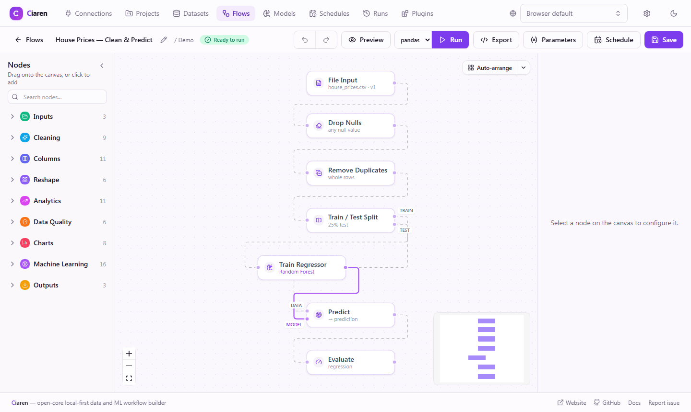

# Ciaren

**Visual workflow builder for local data pipelines and lightweight ML workflows.
Build visually, run locally, export clean Python.**

Ciaren helps you build data workflows on a visual canvas, run them locally,
preview intermediate results, and export readable Python using pandas, Polars,
or lazy Polars. It is designed for local-first experimentation, repeatable data
preparation, and lightweight machine-learning workflows without adopting a
heavy orchestration stack.

[](https://github.com/ciaren-labs/Ciaren/actions/workflows/backend-tests.yml)
[](https://github.com/ciaren-labs/Ciaren/actions/workflows/frontend-tests.yml)
[](https://github.com/ciaren-labs/Ciaren/actions/workflows/docker.yml)
[](https://github.com/ciaren-labs/Ciaren/actions/workflows/docs-deploy.yml)
[](LICENSE)
[](backend/app/plugin_api/)




> **Alpha software.** Ciaren is under active development. APIs, workflow
> formats, generated code, plugin interfaces, and internal data models may
> change between releases. Use it for experimentation, prototyping, and
> controlled internal workflows before relying on it for critical production
> jobs.

## Why Try Ciaren

- **Build visually:** assemble file, SQL, transformation, validation, and output
  steps on a canvas.
- **Run locally:** use SQLite by default and keep data on infrastructure you
  control.
- **Preview each step:** inspect intermediate results before running the full
  workflow.
- **Export Python:** generate readable pandas, Polars, or lazy Polars code that
  can be reviewed and run outside Ciaren.
- **Automate lightly:** use the alpha scheduler, CLI, REST API, or webhooks for
  controlled local/self-hosted workflows.
- **Extend carefully:** build against the public Plugin API/SDK, which is still
  evolving during alpha.

## Quickstart

### Requirements

- Python 3.12+
- Node.js 18+ for the visual editor
- SQLite by default; PostgreSQL and MySQL are available through
  `CIAREN_DATABASE_URL` with async drivers

### Backend Setup

```bash
git clone https://github.com/ciaren-labs/Ciaren.git
cd ciaren/backend

python -m venv .venv
source .venv/bin/activate        # Windows: .venv\Scripts\activate

pip install -e .
ciaren serve
```

<!-- Before public launch, verify the clone URL after the repository transfer. -->

The backend starts at `http://localhost:8055`. Interactive API docs are
available at `http://localhost:8055/docs`.

### Frontend Setup

In another terminal:

```bash
cd ciaren/frontend
npm install
npm run dev
```

Open `http://localhost:5173`, upload a CSV/Excel/Parquet file, build a flow,
preview the data, run it, and export Python.

### Docker Setup

```bash
docker compose up --build
```

Then open `http://localhost:8055`.

## Who It Is For

- **Data analysts:** clean, reshape, validate, and export datasets without
  writing every step by hand.
- **Data engineers:** prototype repeatable transformations locally before
  turning them into code.
- **Python learners:** see how visual dataframe operations become pandas and
  Polars code.
- **ML practitioners:** try lightweight ML workflows with MLflow tracking,
  built in from a plain `pip install ciaren`.
- **Plugin authors:** build custom nodes and integrations against the public
  Plugin API/SDK.

## Features

- **Visual workflow builder:** available in the alpha build.
- **File input/output:** CSV, Excel, Parquet, JSON/JSONL, text, and related
  formats.
- **Transformation nodes:** 42 built-in transformation nodes available in the
  alpha build.
- **Preview and run history:** available for inspecting workflow behavior.
- **Code export:** pandas, Polars, and lazy Polars Python export.
- **SQL databases:** early support through saved connections.
- **Scheduling:** alpha cron scheduler with retries, catch-up, overlap
  protection, and auto-disable.
- **Machine Learning:** built in, MLflow-tracked (alpha); XGBoost/LightGBM
  models are an optional extra (`pip install ciaren[ml]`).
- **Plugins:** alpha Plugin API/SDK with local discovery and signed package
  support.

For full details, see the [documentation](https://ciaren.com/docs/).

## Documentation

- [Quick Start](https://ciaren.com/docs/guide/quick-start)
- [Examples](https://ciaren.com/docs/examples/sales-analysis)
- [Plugin Guide](https://ciaren.com/docs/plugins/first-plugin)
- [Roadmap](https://ciaren.com/docs/guide/roadmap)
- [Security](SECURITY.md)
- [Contributing](CONTRIBUTING.md)

## Contributing

Ciaren is early, and useful contributions are welcome: bug reports,
reproducible flows, docs improvements, examples, transformation nodes, plugin
SDK improvements, and frontend workflow polish.

Start with [CONTRIBUTING.md](CONTRIBUTING.md). Ideas and support requests can
go to [GitHub Discussions](https://github.com/ciaren-labs/Ciaren/discussions), and
bugs or feature requests can go to
[GitHub Issues](https://github.com/ciaren-labs/Ciaren/issues).

## Security

Ciaren is alpha software intended for local-first experimentation,
prototyping, and controlled self-hosted workflows. Review exported Python code,
test flows before using important data, and add appropriate operational
controls before using Ciaren in sensitive or critical environments.

Please report vulnerabilities using the process in [SECURITY.md](SECURITY.md).

## Licensing

- **Ciaren Core:** AGPL-3.0-only.
- **Public Plugin API / SDK:** Apache-2.0.
- **Plugins:** may use their own compatible license, depending on the plugin
  author and distribution model.
- **Future cloud or hosted services:** not necessarily covered by this open
  source repository license.

See [LICENSE](LICENSE), [NOTICE](NOTICE), and [LICENSES/](LICENSES/) for the
complete license texts and notices.

## Project Status

- Current stage: **Alpha**
- First public release target: `v0.1.0-alpha.1`
- Breaking changes are expected before `1.0.0`

**Made for data practitioners who value simplicity, reproducibility, and useful
local workflows.**
